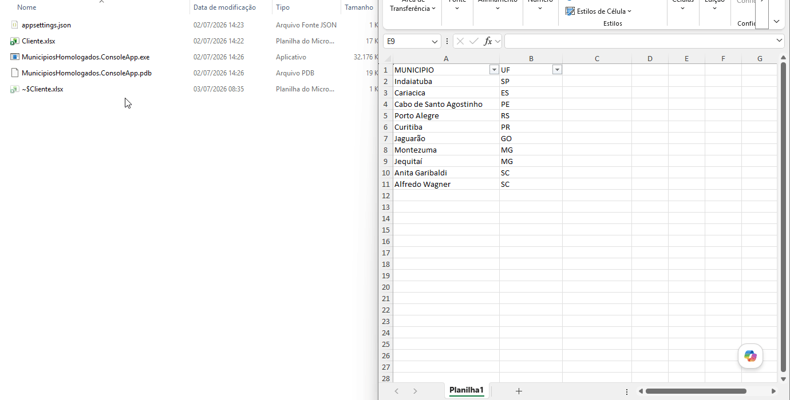

# 🚀 Validador de Municípios Homologados NDD


### 🎥 Demonstração
<p align="center">
  
</p>

---
### 📌 Introdução

* Uma automação desenvolvida em **.NET 10** para validação dos municípios homologados em nossa base. 

* O sistema realiza a captura de dados em tempo real no site da NDD, faz o cruzamento em memória (equivalente a um PROCV de altíssima performance) utilizando a base oficial de municípios do IBGE e gera um relatório final totalmente estilizado sob os padrões corporativos.
---
### 🛠 Tecnologias
* .NET 10
* C#
* JSON
* PowerShell
---
---

## 💡 O Problema vs. A Solução

### Abordagem:
* **Web Scraping Otimizado:** Uso de requisições HTTP puras e assíncronas com `HttpClient`, combinadas com a análise estruturada da árvore HTML via `HtmlAgilityPack`.
* **Processamento In-Memory:** Carregamento da base do IBGE e dados da NDD em dicionários hash (`Dictionary<string, T>`), reduzindo o tempo de cruzamento de dados para escopo de milissegundos.
* **Manipulação Limpa de Arquivos:** Uso do **EPPlus** para leitura e escrita direta nos arquivos Excel, permitindo inclusive a formatação visual e design zebrado automático sem necessidade de interagir com o ecossistema do MS Office.

---

## 🛠 Tecnologias Utilizadas

* **Linguagem:** C# (.NET 10)
* **Parser HTML:** HtmlAgilityPack
* **Manipulação de Planilhas:** EPPlus (Licença Não Comercial)
* **Arquitetura:** Clean Console Application (Separated Services Pattern)

---

## 📁 Estrutura do Projeto

```text
MunicipiosHomologados/
│
├── .gitignore                      # Bloqueio de arquivos binários e planilhas reais (LGPD)
├── Publicar_Compacto.bat           # Script de automação de build e deploy limpo
│
└── MunicipiosHomologados.ConsoleApp/
    ├── Configuration/              # Gerenciamento de configurações via JSON
    ├── Resources/                  # Modelos e bases de dados locais
    ├── Services/                   # Camada de serviços (NddService, IbgeService, ExcelService)
    ├── Util/                       # Utilitários globais (Logger customizado)
    └── appsettings.json            # Parametrização externa das URLs e arquivos

---

### 👨‍💻 Autor

**Vanderluiz Oliveira**
